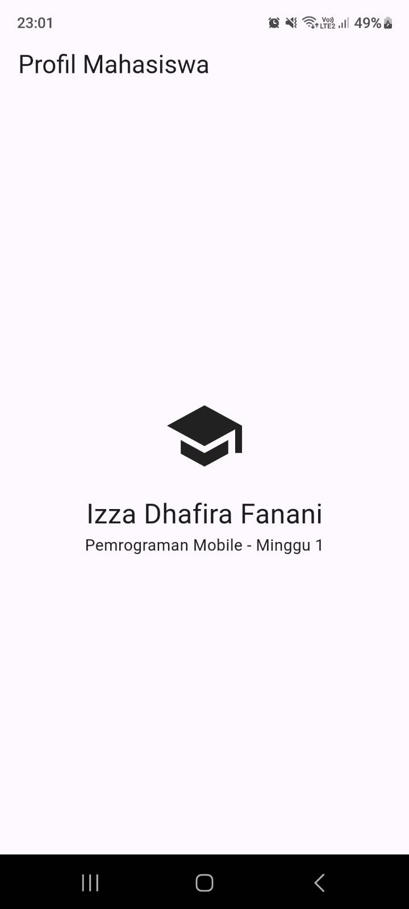
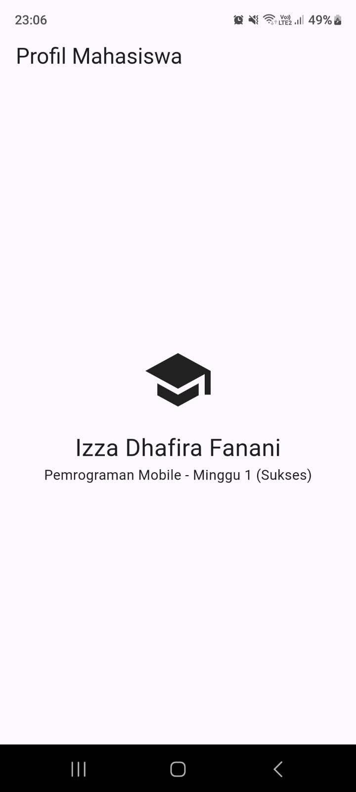
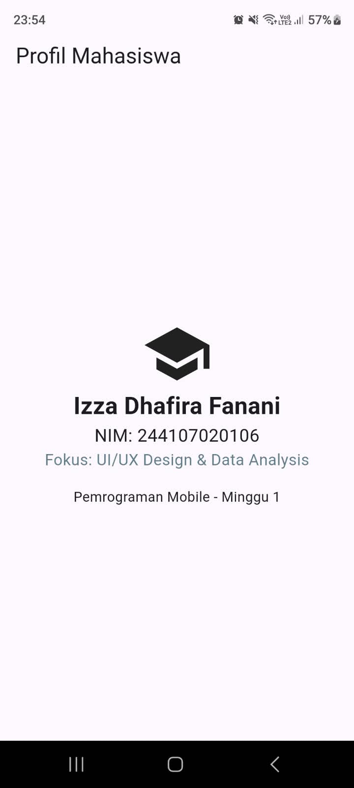

# Tugas Minggu 1: Mobile Development Ecosystem & Flutter Refresh

## 1. Screenshot Hasil Aplikasi

## 2. Kendala Setup
Kendala utama yang saya temui adalah proses flutter doctor --android-licenses yang error. Hal ini disebabkan oleh sistem membaca SDK Command-line Tools versi terbaru (v23/v22) yang ternyata memiliki struktur deprecated. Solusinya adalah dengan menghapus versi terbaru tersebut dari SDK Manager di Android Studio, lalu mengunduh dan menggunakan Command-line Tools khusus versi 8.0 agar lisensi dapat disetujui. Selain itu, ada kendala cache lock dari Gradle saat build pertama kali yang bisa diatasi dengan mematikan proses Java di latar belakang.

## 3. Refleksi
* **Kapan native lebih tepat dipilih daripada cross-platform?**
  Pendekatan native lebih tepat saat aplikasi membutuhkan performa maksimal (seperti render grafis berat), butuh integrasi tingkat rendah ke hardware spesifik, atau perlu mengadopsi fitur OS paling baru yang belum didukung oleh framework cross-platform.
* **Bagaimana perubahan state berhubungan dengan widget tree dan UI deklaratif?**
  Pada UI deklaratif seperti Flutter, tampilan adalah cerminan dari state saat ini. Ketika state berubah, Flutter tidak mengubah elemen UI satu per satu secara manual, melainkan membangun ulang widget tree yang terdampak sehingga UI otomatis menyesuaikan dengan data terbaru.
* **Mengapa commit kecil dengan pesan jelas bermanfaat bagi pekerjaan tim dan portofolio?**
  Commit yang kecil memudahkan pelacakan perubahan kode dan rollback jika terjadi bug. Pesan yang jelas sangat membantu tim memahami maksud perubahan tanpa harus membaca seluruh kode, meminimalisir merge conflict, dan menunjukkan standar profesionalisme dalam portofolio pengembangan software.