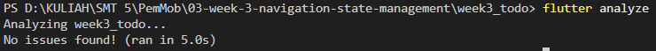
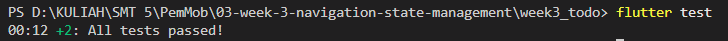

## Laporan Verifikasi Refactoring ToDo App

* **Pemisahan Logika & UI:** Komponen daftar tugas berhasil diekstrak menjadi `TodoTile` tersendiri, membuat struktur kode lebih modular. Logika filter tugas yang belum selesai diisolasi menggunakan provider turunan (`uncompletedTodosProvider`).
* **Navigasi GoRouter Bekerja:** Implementasi `ShellRoute` dan `NavigationBar` berhasil mengelola perpindahan halaman antara `/` (Daftar Tugas) dan `/stats` (Statistik). Navigasi maju, mundur, dan akses *path* langsung beroperasi normal.
* **Persistensi State (ProviderScope):** `ProviderScope` telah diterapkan pada *root* aplikasi (`MyApp`). *State* daftar tugas pada memori terbukti persisten dan tidak *reset* saat pengguna berpindah-pindah menu navigasi GoRouter.
* **Penanganan UI AsyncValue:** Implementasi *provider* asinkron menggunakan `.when()` sukses menangani ketiga kondisi *state* secara komprehensif: memunculkan *spinner* saat `loading`, teks informatif dan tombol *retry* saat `error`, serta daftar ListView saat `success`.
* **Pengujian Lulus Mutlak:** 
  * `flutter analyze`: Bersih, tidak ada isu (*No issues found!*).
  
  * `flutter test`: Pengujian UI (`widget_test.dart`) untuk skenario menambah tugas, memvalidasi input *TextField*, dan kemunculan teks *item* baru lolos sempurna setelah jeda animasi dialog (`pumpAndSettle()`) ditangani.
  